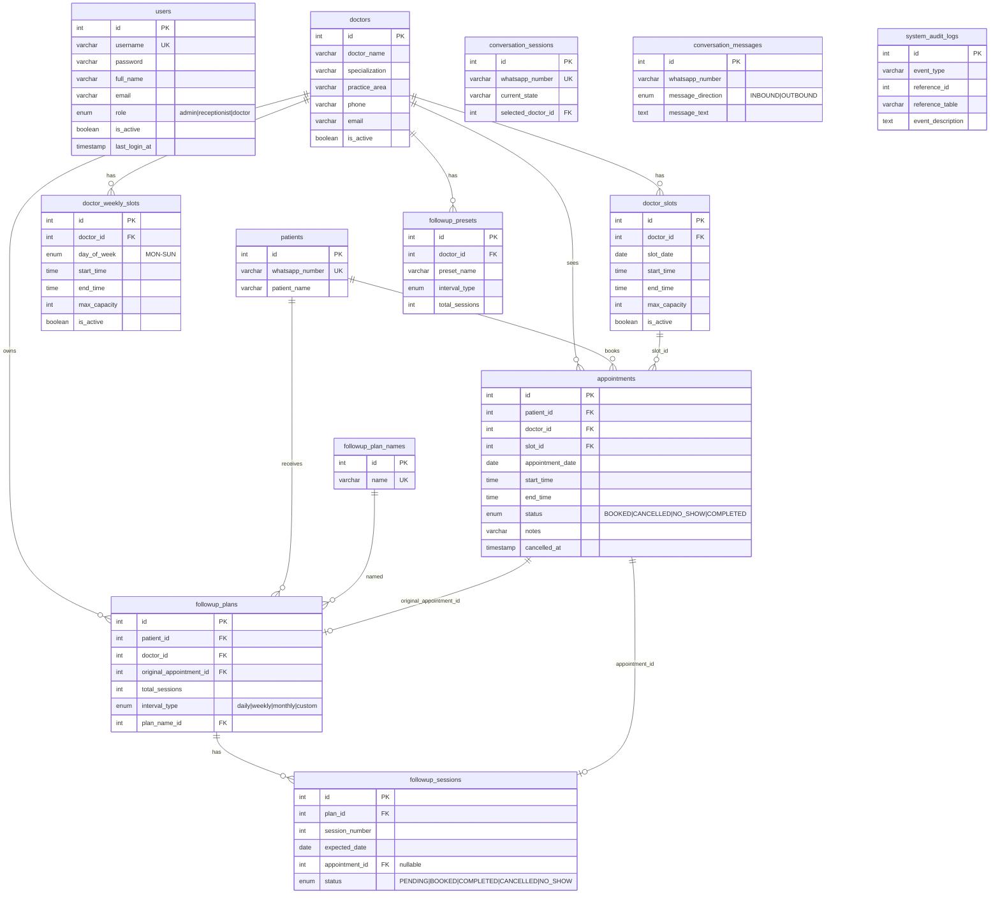
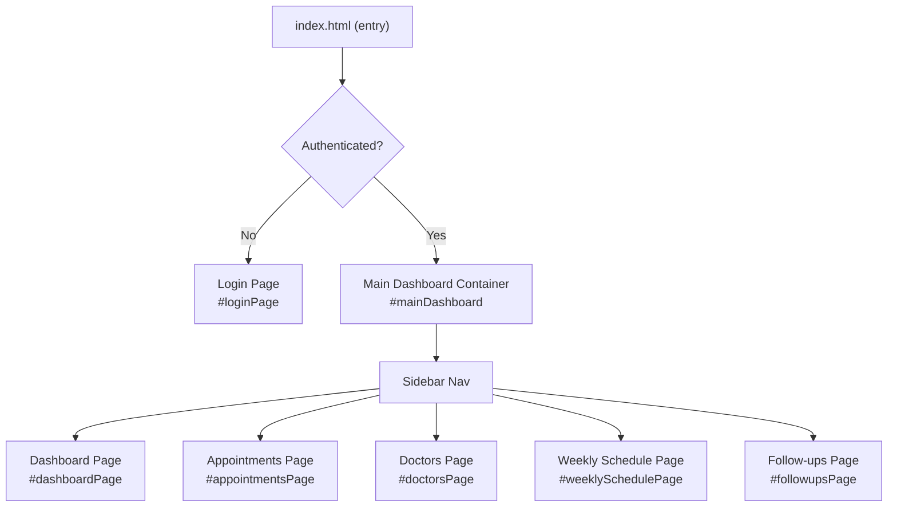
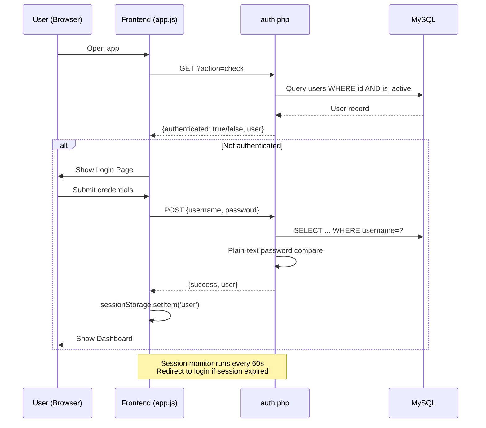
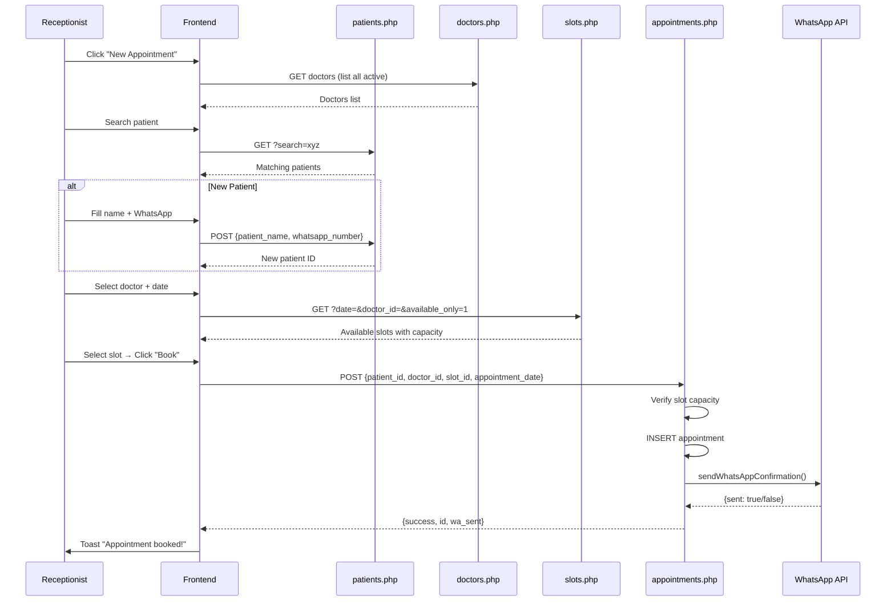
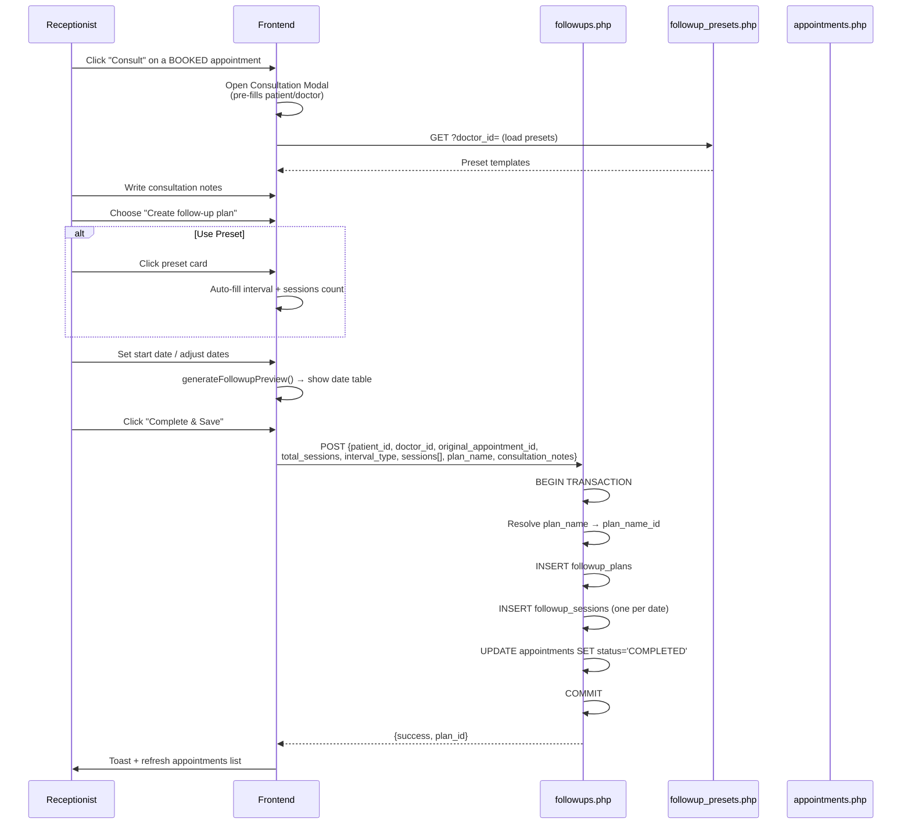
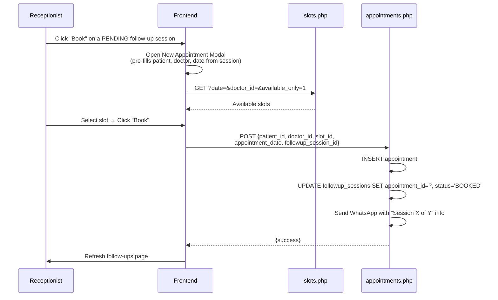
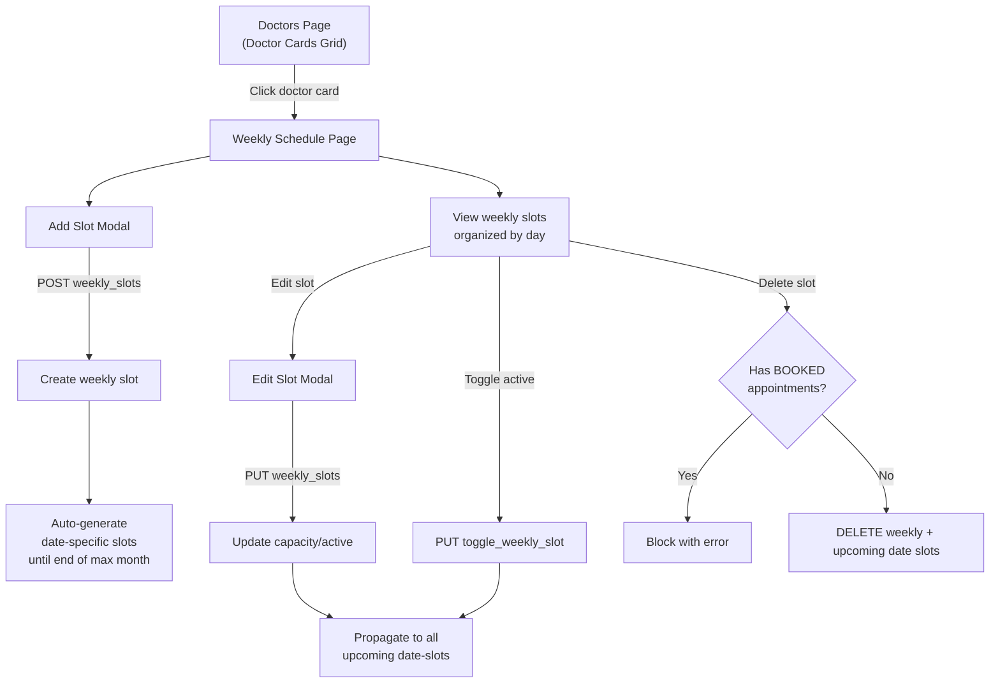
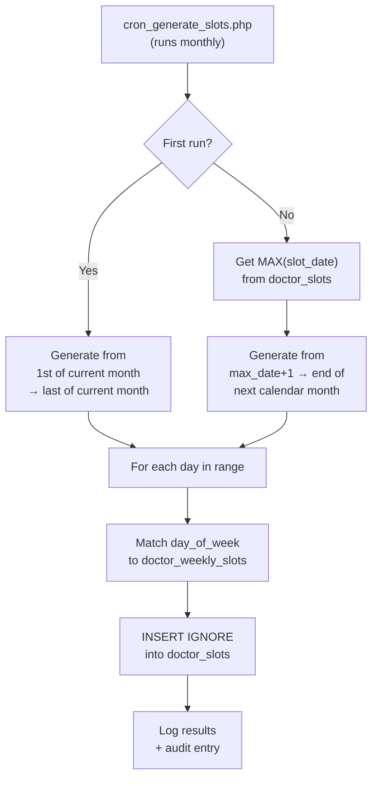
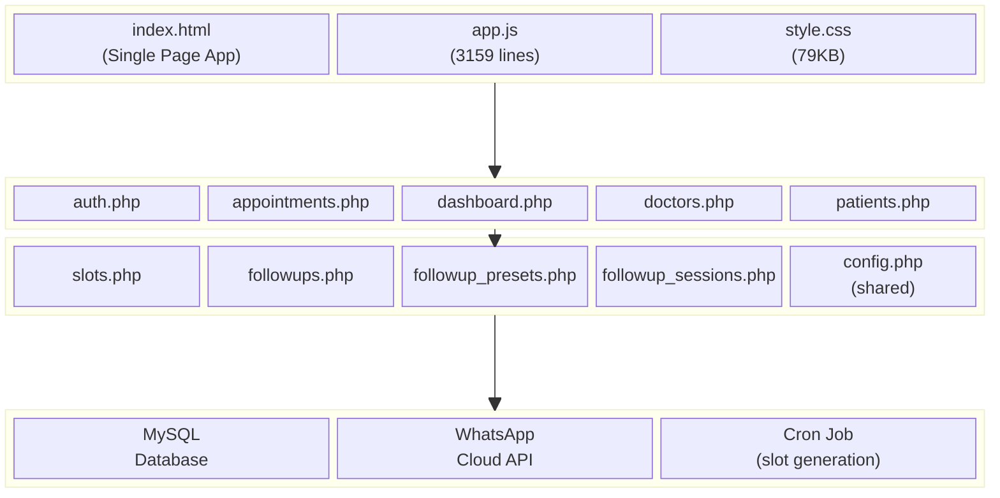

# ClavitekDemoDental — Complete Project Walkthrough

> **Purpose**: Full architecture documentation for React + Node.js migration planning.

---

## 1. Tech Stack Overview

| Layer | Technology | Details |
|-------|-----------|---------|
| **Frontend** | Single HTML page ([index.html](file:///c:/xampp/htdocs/ClavitekDemoDental/index.html)) + Vanilla JS ([app.js](file:///c:/xampp/htdocs/ClavitekDemoDental/js/app.js)) + CSS ([style.css](file:///c:/xampp/htdocs/ClavitekDemoDental/css/style.css)) | SPA with client-side routing via DOM show/hide |
| **Backend** | PHP 7+ (procedural, no framework) | 10 API files under `/api/` |
| **Database** | MySQL (via PDO) | 11+ tables, hosted on `localhost` |
| **Server** | Apache (XAMPP) | Serves static HTML + PHP endpoints |
| **Auth** | PHP Sessions (cookie-based) | Plain-text password comparison |
| **Icons** | Lucide Icons (CDN) | SVG icon library |
| **Charts** | Chart.js 4.4.0 (CDN) | Bar + Pie charts on dashboard |
| **Notifications** | Meta WhatsApp Cloud API | Template-based messages via cURL |
| **Cron** | PHP script (`cron/cron_generate_slots.php`) | Monthly slot auto-generation |

---

## 2. Project Structure

```
ClavitekDemoDental/
├── index.html                      ← Single-page app (957 lines)
├── css/
│   └── style.css                   ← All styles (79KB)
├── js/
│   └── app.js                      ← All frontend logic (3159 lines, 127KB)
├── api/
│   ├── config.php                  ← DB connection, auth helpers, WhatsApp sender
│   ├── auth.php                    ← Login/logout/session-check
│   ├── appointments.php            ← Appointment CRUD + CSV export
│   ├── dashboard.php               ← Dashboard stats + heatmap data
│   ├── doctors.php                 ← Doctor CRUD + weekly slot management (1081 lines)
│   ├── patients.php                ← Patient search + create
│   ├── slots.php                   ← Date-specific slot listing + update
│   ├── followups.php               ← Follow-up plan CRUD with pagination
│   ├── followup_presets.php         ← Preset CRUD (templates for follow-ups)
│   └── followup_sessions.php       ← Session rescheduling (PATCH)
├── db/
│   ├── schema.sql                  ← Full schema + sample data
│   ├── add_followup_tables.sql     ← Follow-up tables migration
│   ├── add_followup_presets.sql    ← Presets table migration
│   ├── add_users_table.sql         ← Users table migration
│   ├── create_user.php             ← User creation utility
│   └── AUTHENTICATION_SETUP.md     ← Auth setup guide
├── cron/
│   ├── cron_generate_slots.php     ← Cron job for slot generation
│   ├── CRON_DOCUMENTATION.md       ← Cron documentation
│   ├── LOGIC_FLOW.md               ← Cron logic flow
│   └── SQL_QUERIES.md              ← Cron SQL queries reference
├── assets/images/                  ← Logo & avatars
└── debug_*.php, verify_*.php       ← Debug/migration utilities (can be ignored)
```

---

## 3. Database Schema (ER Diagram)



---

## 4. Frontend Architecture (SPA Pages & Components)

### 4.1 Page / View Map

The app is a **Single Page Application** with 5 views (show/hide via CSS):



### 4.2 UI Component Inventory

| Component | Location | Description |
|-----------|----------|-------------|
| **Login Card** | `#loginPage` | Username/password form, logo |
| **Sidebar** | `.sidebar` | Navigation (Dashboard, Appointments, Doctors, Follow-ups), Logout |
| **Top Header** | `.top-header` | Page title, "New Appointment" button, mobile hamburger |
| **KPI Cards** | `#dashboardPage .kpi-grid` | 4 stat cards (Total, Completed, Cancelled, No-Show) |
| **Heatmap** | `#heatmapContainer` | 7-day time-slot utilization grid (custom HTML render) |
| **Charts** | `#doctorBarChart`, `#statusPieChart` | Chart.js bar + pie charts |
| **Appointments Table** | `#appointmentsTableBody` | Filterable data table with status actions |
| **Doctor Cards** | `#doctorsCardContainer` | Doctor profile cards with slot count |
| **Weekly Schedule** | `#weeklyScheduleContainer` | Day-by-day slot management grid |
| **Follow-up Cards** | `#followupsContainer` | Plan cards with progress bars + session lists |
| **Pagination** | `#followupsPagination` | Server-side pagination for follow-ups |

### 4.3 Modal Inventory

| Modal | ID | Trigger | Purpose |
|-------|----|---------|---------|
| **New Appointment** | `#newAppointmentModal` | Header "New Appointment" button OR follow-up "Book" action | Search/create patient → Select doctor + date → Pick slot → Book |
| **Consultation & Follow-up** | `#consultationModal` | "Consult" action on BOOKED appointment | Notes + optional follow-up plan creation |
| **Add/Edit Slot** | `#slotModal` | "Add Slot" button in weekly schedule | Create/edit weekly recurring slot |
| **Manage Presets** | `#managePresetsModal` | "Manage Presets" button on Follow-ups page | CRUD for follow-up templates per doctor |
| **Reschedule Session** | `#rescheduleModal` | "Reschedule" icon on follow-up session | Change expected_date of a session |

---

## 5. API Endpoint Reference

### 5.1 Auth (`api/auth.php`)

| Method | Params / Action | Description | Protected |
|--------|----------------|-------------|-----------|
| `POST` | `{username, password}` | Login → sets session | No |
| `POST` | `?action=logout` | Logout → destroys session | No |
| `GET` | `?action=check` | Session validation | No |

### 5.2 Dashboard (`api/dashboard.php`)

| Method | Params | Description | Protected |
|--------|--------|-------------|-----------|
| `GET` | `?date_from=&date_to=&status=&doctor_id=` | Returns stats (total/completed/cancelled/no-show), doctor breakdown, heatmap data, doctors list | Yes |

### 5.3 Appointments (`api/appointments.php`)

| Method | Params | Description | Protected |
|--------|--------|-------------|-----------|
| `GET` | `?date=&date_from=&date_to=&search=&doctor_id=&status=&type=` | List appointments with filters | Yes |
| `GET` | `?action=export&...` | Download CSV export | Yes |
| `POST` | `{patient_id, doctor_id, slot_id, appointment_date, notes?, followup_session_id?}` | Create appointment + send WhatsApp confirmation | Yes |
| `PUT` | `{id, status, notes?}` | Update status (BOOKED/COMPLETED/CANCELLED/NO_SHOW), syncs follow-up session | Yes |

### 5.4 Doctors (`api/doctors.php`)

| Method | Action | Description | Protected |
|--------|--------|-------------|-----------|
| `GET` | (default) | List all doctors with active_slots_count | Yes |
| `GET` | `?action=weekly_slots&doctor_id=` | Get weekly slots for a doctor | Yes |
| `GET` | `?action=get_weekly_slot&id=` | Get single weekly slot | Yes |
| `POST` | `?action=weekly_slots` + `{doctor_id, day_of_week, start_time, end_time, max_capacity, is_active}` | Create weekly slot + auto-generate date-specific slots | Yes |
| `PUT` | (default) | Toggle doctor is_active | Yes |
| `PUT` | `?action=weekly_slots` + `{id, max_capacity, is_active}` | Update weekly slot + propagate to upcoming date slots | Yes |
| `PUT` | `?action=toggle_weekly_slot` + `{id, is_active}` | Toggle weekly slot active status + propagate | Yes |
| `DELETE` | `?action=delete_weekly_slot&id=` | Delete weekly slot + cascade delete upcoming date slots (blocked if BOOKED appointments exist) | Yes |

### 5.5 Patients (`api/patients.php`)

| Method | Params | Description | Protected |
|--------|--------|-------------|-----------|
| `GET` | `?search=` | Search by name or phone (normalized) | Yes |
| `POST` | `{patient_name, whatsapp_number}` | Create or return existing patient (upsert-like) | Yes |

### 5.6 Slots (`api/slots.php`)

| Method | Params | Description | Protected |
|--------|--------|-------------|-----------|
| `GET` | `?date=&doctor_id=&available_only=` | List date-specific slots with booking counts | Yes |
| `PUT` | `{id, max_capacity?, is_active?}` | Update individual date-specific slot | Yes |

### 5.7 Follow-ups (`api/followups.php`)

| Method | Params | Description | Protected |
|--------|--------|-------------|-----------|
| `GET` | `?status=ALL/IN_PROGRESS/COMPLETED&search=&page=&limit=` | Paginated follow-up plans with sessions, global counts | Yes |
| `GET` | `?action=get_plan_names` | List all plan names (for datalist autocomplete) | Yes |
| `POST` | `{patient_id, doctor_id, original_appointment_id, total_sessions, interval_type, sessions[], plan_name, consultation_notes}` | Create plan + sessions + mark original appointment COMPLETED | Yes |

### 5.8 Follow-up Presets (`api/followup_presets.php`)

| Method | Params | Description | Protected |
|--------|--------|-------------|-----------|
| `GET` | `?doctor_id=` | List presets for doctor | Yes |
| `POST` | `{doctor_id, preset_name, interval_type, total_sessions}` | Create preset | Yes |
| `PUT` | `{id, preset_name, interval_type, total_sessions}` | Update preset | Yes |
| `DELETE` | `?id=` | Delete preset | Yes |

### 5.9 Follow-up Sessions (`api/followup_sessions.php`)

| Method | Params | Description | Protected |
|--------|--------|-------------|-----------|
| `PATCH` | `{id, expected_date}` | Reschedule a session's expected date | Yes |

---

## 6. Core Workflow Flowcharts

### 6.1 Authentication Flow



### 6.2 New Appointment Flow



### 6.3 Consultation & Follow-up Creation Flow



### 6.4 Follow-up Session Booking Flow



### 6.5 Doctor Schedule Management Flow



### 6.6 Cron: Slot Generation Flow



---

## 7. System Block Diagram



---

## 8. State Management (Frontend)

The app uses **global JS variables** and **sessionStorage** for state:

| State | Storage | Purpose |
|-------|---------|---------|
| `currentUser` | Global var + `sessionStorage('user')` | Current logged-in user |
| `appointments` | Global var (array) | Cached appointments for current view |
| `doctors` | Global var (array) | Cached doctors list |
| `doctorBarChart` / `statusPieChart` | Global var (Chart.js instances) | Dashboard chart references |
| Follow-up filter status | DOM-driven (`followupCurrentStatus`, `followupCurrentPage`) | Which tab is active + pagination |

**Navigation**: `navigateTo(page)` shows/hides `div.page` elements and triggers data loading for each page.

---

## 9. React + Node.js Migration Mapping

### 9.1 Frontend → React

| Current Component | React Equivalent |
|-------------------|------------------|
| `index.html` (SPA) | React Router (`/login`, `/dashboard`, `/appointments`, `/doctors`, `/doctors/:id/schedule`, `/followups`) |
| `navigateTo(page)` | `react-router-dom` `<Route>` + `useNavigate()` |
| Global vars (`currentUser`, `appointments`) | React Context or Redux/Zustand store |
| `app.js` functions | Split into React hooks: `useAuth`, `useDashboard`, `useAppointments`, `useDoctors`, `useFollowups` |
| DOM manipulation (`innerHTML`, `style.display`) | React JSX components with conditional rendering |
| `sessionStorage` | Auth context + HTTP-only cookie (JWT) |
| `fetch()` calls | Axios/fetch with interceptors in a central API service |
| Chart.js direct usage | `react-chartjs-2` wrapper |
| Lucide Icons (CDN) | `lucide-react` package |

### Recommended React Pages/Components

```
src/
├── pages/
│   ├── LoginPage.jsx
│   ├── DashboardPage.jsx
│   ├── AppointmentsPage.jsx
│   ├── DoctorsPage.jsx
│   ├── DoctorSchedulePage.jsx
│   └── FollowupsPage.jsx
├── components/
│   ├── Layout/
│   │   ├── Sidebar.jsx
│   │   ├── TopHeader.jsx
│   │   └── ProtectedRoute.jsx
│   ├── Dashboard/
│   │   ├── KPICards.jsx
│   │   ├── Heatmap.jsx
│   │   ├── DoctorBarChart.jsx
│   │   └── StatusPieChart.jsx
│   ├── Appointments/
│   │   ├── AppointmentFilters.jsx
│   │   ├── AppointmentTable.jsx
│   │   └── AppointmentRow.jsx
│   ├── Doctors/
│   │   ├── DoctorCard.jsx
│   │   ├── WeeklyScheduleGrid.jsx
│   │   └── SlotModal.jsx
│   ├── Followups/
│   │   ├── FollowupTiles.jsx
│   │   ├── FollowupPlanCard.jsx
│   │   ├── SessionTimeline.jsx
│   │   └── PresetsModal.jsx
│   ├── Modals/
│   │   ├── NewAppointmentModal.jsx
│   │   ├── ConsultationModal.jsx
│   │   └── RescheduleModal.jsx
│   └── Common/
│       ├── Toast.jsx
│       ├── Spinner.jsx
│       └── PatientSearchAutocomplete.jsx
├── hooks/
│   ├── useAuth.js
│   ├── useDashboard.js
│   ├── useAppointments.js
│   ├── useDoctors.js
│   ├── useFollowups.js
│   └── usePatientSearch.js
├── services/
│   └── api.js           ← Centralized HTTP client
├── context/
│   └── AuthContext.jsx
└── App.jsx
```

### 9.2 Backend → Node.js (Express)

| PHP File | Node.js Equivalent |
|----------|-------------------|
| `config.php` | `config/db.js` (connection pool), `config/env.js` (env vars), `middleware/auth.js` |
| `auth.php` | `routes/auth.js` → `controllers/authController.js` |
| `appointments.php` | `routes/appointments.js` → `controllers/appointmentController.js` |
| `dashboard.php` | `routes/dashboard.js` → `controllers/dashboardController.js` |
| `doctors.php` | `routes/doctors.js` → `controllers/doctorController.js` |
| `patients.php` | `routes/patients.js` → `controllers/patientController.js` |
| `slots.php` | `routes/slots.js` → `controllers/slotController.js` |
| `followups.php` | `routes/followups.js` → `controllers/followupController.js` |
| `followup_presets.php` | `routes/followupPresets.js` → `controllers/presetController.js` |
| `followup_sessions.php` | `routes/followupSessions.js` → `controllers/sessionController.js` |
| `cron_generate_slots.php` | `jobs/generateSlots.js` (with `node-cron` or `bull` queue) |
| `sendWhatsAppConfirmation()` | `services/whatsappService.js` |
| PHP Sessions | JWT tokens (`jsonwebtoken` + `bcrypt` for passwords) |
| PDO (MySQL) | `mysql2` or Sequelize/Knex ORM |

### Recommended Node.js Structure

```
server/
├── config/
│   ├── db.js              ← MySQL pool (mysql2)
│   └── env.js             ← dotenv config
├── middleware/
│   ├── auth.js            ← JWT verification middleware
│   └── errorHandler.js
├── routes/
│   ├── auth.js
│   ├── appointments.js
│   ├── dashboard.js
│   ├── doctors.js
│   ├── patients.js
│   ├── slots.js
│   ├── followups.js
│   ├── followupPresets.js
│   └── followupSessions.js
├── controllers/
│   ├── authController.js
│   ├── appointmentController.js
│   ├── dashboardController.js
│   ├── doctorController.js
│   ├── patientController.js
│   ├── slotController.js
│   ├── followupController.js
│   ├── presetController.js
│   └── sessionController.js
├── services/
│   ├── whatsappService.js
│   └── auditService.js
├── jobs/
│   └── generateSlots.js   ← Scheduled with node-cron
├── app.js                 ← Express app setup
└── server.js              ← Entry point
```

---

## 10. Key Migration Concerns

> [!IMPORTANT]
> **Auth Security**: Current app uses plaintext password comparison. Migration MUST use `bcrypt` hashing + JWT tokens.

> [!WARNING]
> **Slot Propagation Logic**: The `doctors.php` file (1081 lines) contains complex slot propagation logic (weekly → date-specific) with appointment conflict checking. This is the most complex backend feature and should be carefully ported with unit tests.

> [!CAUTION]
> **WhatsApp Integration**: The Meta Cloud API Access Token is hardcoded in `config.php`. In Node.js, use environment variables and rotate tokens regularly.

| Concern | Current | Migration Target |
|---------|---------|-----------------|
| Auth | PHP sessions, plaintext passwords | JWT + bcrypt, HTTP-only cookies |
| CORS | `*` (open) | Whitelist specific origins |
| State | Global JS variables | React Context/Redux + React Query for server state |
| API calls | Raw fetch with inline error handling | Centralized API service with interceptors |
| Styling | Single 79KB CSS file | CSS Modules or Styled Components (split per component) |
| DB | PDO with inline SQL | mysql2 pool with parameterized queries or Sequelize ORM |
| Slot cron | PHP script called via system cron | node-cron or external job scheduler |
| File structure | Monolithic (1 HTML, 1 JS, 1 CSS) | Component-based modular architecture |
